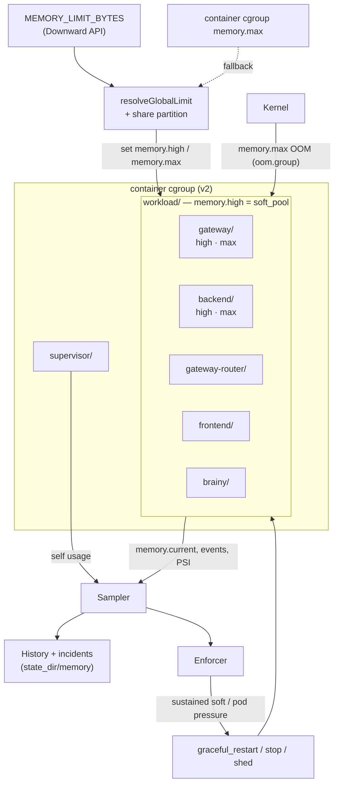

# Supervisor Memory Management

## Problem

The supervisor pod currently runs multiple child processes inside one Kubernetes container. Kubernetes enforces only the container-level memory limit, so when aggregate memory crosses the pod limit, the kernel kills the cgroup. That loses attribution: we know the pod was OOM-killed, but not which component, request path, or growth pattern caused it.

The supervisor should own two related responsibilities:

1. Track and persist memory usage information.
2. Enforce per-process or per-component memory limits before Kubernetes kills the whole pod.

## Goals

- Attribute memory usage to each supervised process.
- Persist enough history to debug OOMs after restart.
- Emit useful logs and metrics before memory pressure becomes fatal.
- Enforce soft and hard memory budgets per component.
- Prefer graceful component restarts over whole-pod OOM kills.

## Implementation Status

This document is the full design. Phase 1 (track, assess, display) shipped
2026-06-30. Phase 2 — the cgroup v2 leaf hierarchy and enforcement layer — is now
implemented as well: on a Linux + cgroup v2 node the supervisor builds a leaf per
component, charges each child into its leaf, attributes usage from the exact
`memory.current`, writes `memory.high`/`memory.max`/`memory.oom.group`, and
enforces soft/hard/pod-pressure policy; off cgroup v2 (the macOS dev box, cgroup
v1) it degrades to exactly the phase-1 tracking-only behavior. The split was
deliberate: phase 1 is platform-portable and shipped value without the risk of
mutating the cgroup hierarchy; phase 2 is additive and guarded behind the
capability check. The phase-2 code (`cgroup.go`, `cgroup_linux.go`,
`cgroup_other.go`, `memory_enforce.go`, plus the sampling/launch/exit wiring) is
Linux-only and still needs the Linux verification loop at the end of this doc,
since it cannot be exercised on macOS.

### Implemented (phase 1)

- **Capability + mode resolution** — `cgroup2` / `cgroup1` / `host` / `disabled`,
  exposed as the `memory_mode` metric. Anything but a real mode is a clean no-op.
  (`memorymode.go`, `memorymode_linux.go`, `memorymode_other.go`)
- **Global-limit resolution** — `MEMORY_LIMIT_BYTES` → an explicit `limit_bytes`
  config override (dev/local) → the container cgroup; first real value wins. The
  host's total RAM and the cgroup's own `memory.max` are also surfaced for context.
- **Tracking on by default** — an absent or `enabled:`-unset `memory:` block still
  measures; only `enabled: false` disables.
- **Per-component sampling via process RSS** — `/proc/<pid>/status` on Linux, `ps`
  on macOS. NOTE: this is RSS, *not* the per-leaf `memory.current` the attribution
  argument below is built on; exact per-leaf accounting arrives with phase 2.
- **Budget derivation + assessment** — soft (`high`) and hard (`limit`) budgets
  derived from the global limit and per-component `share`, used only to classify
  `ok` / `soft` / `hard` and to display. Nothing is written to the kernel.
- **Two-tier persistence** under `<state_dir>/memory/` — `current.json`, raw
  per-day NDJSON kept for `raw_window`, and continuous 1-minute rollups
  (min/mean/max per component) kept to `retention`, with tiered pruning. The
  series endpoint and sparkline merge the recent raw ring with the rollup tier.
  (`memory_persist.go`, `memory_rollup.go`)
- **Incident capture** — on abnormal child exit, the last `incident_samples` are
  snapshotted to `memory/incidents/<ts>-<kind>.json`, surfaced via
  `memory_last_event` and `/backoffice/memory/incidents`. (`memory_incident.go`)
- **Memory health state** — a per-component `memory` statekit leaf
  (`soft → warn`, `hard → fail`) flows into the `supervisorstate` aggregate,
  `/state`, and the portal badge.
- **Display + metrics** — snapshot fields, portal card statline + detail stat
  cards + inline SVG sparkline, `/backoffice/memory`, `/backoffice/memory/incidents`,
  per-component series JSON, `/summary` fields, and the Prometheus gauges under
  Metrics (component/pod/mode/sample-time gauges; event and restart counters
  arrive with enforcement).

Naming note: the hard limit is called **`limit`** everywhere it is reported
(field `limit_bytes`, metric `component_memory_limit_bytes`), never `max` — `max`
is reserved for "maximum observed" (e.g. the rollup `max_bytes` peak).

### Phase 2 (cgroup v2 leaves + enforcement) — IMPLEMENTED

The cgroup leaf hierarchy is created, each child is charged into its leaf,
per-component attribution is switched from RSS to exact `memory.current`, and the
soft/hard/pod-pressure enforcement the kernel and supervisor share is in place.
Linux + cgroup v2 only; still needs a Linux test environment to exercise. The
previously-deferred config knobs (`pss_interval`, `pod_pressure_high`,
`pod_pressure_psi`, and the per-component `oom_group` / `sustained_for` /
`grace_period` / `min_uptime` / `cooldown` / `pressure_action` / `priority` /
`critical`) are all parsed, defaulted, validated, and honored. Full plan and the
Linux verification steps are at the end.

Two intentional deviations from the original sketch, both to protect the
non-breaking guarantee and to fit the platform:

- **Leaf charging uses the post-`Start()` `cgroup.procs` write, not
  `UseCgroupFD`.** `clone3(CLONE_INTO_CGROUP)` would abort `Start()` on a kernel
  that does not support it, which would break launch; the post-start write always
  works on cgroup v2 and only accepts the brief, documented window where the child
  is charged to `supervisor/` first.
- **`component_memory_share` and `pod_memory_pressure_some_ratio` are not emitted
  as gauges.** statekit gauges are `int64`, and both values are sub-1.0 fractions
  that would round to 0; they are carried on the sample JSON and the
  `/backoffice/memory` view instead, where floats are exact.

## Runtime Model



## Environment And Cgroup Layout

Status: PHASE 2. The leaf hierarchy described here is created by the cgroup v2
slices (the final part); phase 1 reads the container cgroup for the global limit
and `memory.current` context but creates no leaves. Mode detection and the
`cgroup1`/`host`/`disabled` degradation paths below are IMPLEMENTED.

This design assumes cgroup v2 with a writable cgroup mount inside the container, a `busybox:1.36` base image, and the supervisor running as PID 1. With no systemd present, the supervisor is the sole manager of the cgroup subtree, so nothing else contends for ownership of the hierarchy. All cgroup interaction is done by direct reads and writes to the cgroup filesystem from the supervisor binary, so the minimal busybox userland does not matter.

The supervisor arranges the container cgroup into one leaf per process. cgroup v2 forbids a cgroup from holding processes once it delegates controllers to children, the "no internal processes" rule, so every process including the supervisor must live in a leaf:

```text
/sys/fs/cgroup/                 container root (cgroup-namespaced), no processes
  cgroup.subtree_control: +memory
  supervisor/                   PID 1 lives here
  workload/                     aggregate cap for all components
    cgroup.subtree_control: +memory
    gateway/
    backend/
    gateway-router/
    frontend/
    brainy/
```

On startup the supervisor:

1. Verifies cgroup v2 is mounted read-write and that `memory` appears in `/sys/fs/cgroup/cgroup.controllers`. If either check fails it falls back to `/proc` polling with no enforcement.
2. Moves itself into `supervisor/` so the root can delegate controllers.
3. Enables `+memory` in the root and in `workload/` subtree control.
4. Creates one leaf per component and writes its limits.
5. At each child launch, starts the child directly inside its leaf so it and any workers it forks are charged there from the first instruction. On Go 1.22+ this uses `exec.Cmd.SysProcAttr.UseCgroupFD` with `CgroupFD` set to an open descriptor on the leaf directory, which the kernel honors through `clone3(CLONE_INTO_CGROUP)`. The fallback for older kernels is to write `cmd.Process.Pid` into the leaf's `cgroup.procs` immediately after `Start()`, accepting a brief window where the child is charged to the parent cgroup. In the supervisor this is the `LaunchChild` path (`pkg/supervisor/component.go`), right at the point where `SysProcAttr` is already being set for `Setpgid`.

Enforcement primitives, `memory.high`, `memory.max`, `memory.oom.group`, and PSI, are cgroup v2 only. On a node that exposes only cgroup v1 the supervisor still resolves the global limit and samples per-leaf usage for tracking, but disables enforcement and reports that it is running in degraded, tracking-only mode. The Linux target nodes are expected to be cgroup v2; v1 is a graceful-degradation path, not a supported enforcement mode.

The supervisor also runs on macOS for development, where there is no cgroup filesystem and no `/proc`. The whole cgroup layer is therefore Linux-only and guarded behind a platform plus capability check. On macOS the supervisor may run in tracking-only mode, sampling per-process memory through the host APIs, the resident footprint via `proc_pid_rusage` (`phys_footprint`) or `ps` as a simple fallback, with no leaves, no limits, and no pod-pressure handling.

Non-breaking guarantee: the memory subsystem is strictly additive and isolated. It must never abort supervisor startup, child launch, or shutdown. It fails open: any failure to detect, create cgroups, sample, enforce, or persist keeps the supervisor running exactly as it would without the subsystem, and the only outward effect is a **dedicated supervisor-scoped statekit state `memory.subsystem`** raised to **warn** with a reason, so the degradation is visible rather than silent. This is a first-class state (registered top-level, shows in `/state`, emits `state_level`), distinct from the per-component `memory` leaves — those keep reporting only their own component's pressure. `markDegraded` (monitor) drives it via `observeMemorySubsystemDegraded` (bundle); a healthy start sets it pass with a mode summary. It covers cgroup2-detected-but-leaves-unavailable, and panics in setup, sampling, enforcement, or a spawned restart goroutine (each is recovered). Capability detection resolves to one of these modes at startup, and any failure downgrades the mode rather than propagating an error:

- `cgroup2`: full tracking and enforcement (Linux, cgroup v2, writable mount, memory controller delegated).
- `cgroup1`: Linux tracking-only, enforcement disabled.
- `host`: macOS tracking-only via host APIs.
- `disabled`: no sampling, no display, no enforcement. This is the resolved mode whenever `memory.enabled` is false, the platform is unsupported, or a host sampler is simply not implemented yet.

The `host` sampler in particular can be left unimplemented in a first cut: the mode resolves to `disabled`, the supervisor behaves exactly as it does today, and the dashboard omits the memory fields. Implementing host sampling later only adds figures, it changes nothing in the supervision path. The resolved mode is recorded and exposed as a metric so it is always clear which mode is active and why.

The `workload/` parent exists so the supervisor can cap all components as a group, separate from its own footprint. Its `memory.high` is the workload soft pool, derived from the environment-supplied global limit minus the supervisor and page-cache reserves (see Enforcement), so it applies kernel-enforced backpressure across all components before the pod cgroup is killed.

Per-leaf accounting is exact and non-overlapping, so it avoids the shared-page overcounting that summed process RSS suffers from. The kernel also exposes three controls per leaf that the supervisor builds enforcement on:

- `memory.high`: a throttling threshold. Above it the kernel aggressively reclaims and throttles the leaf but does not kill, which slows a leak and buys the supervisor time to react. This is the soft limit.
- `memory.max`: a hard ceiling. Above it the kernel OOM-kills inside the leaf. This is the hard limit and the kernel backstop if userspace does not act in time.
- `memory.oom.group`: kills all processes in the leaf together, so a component that forks workers is restarted as a clean unit rather than left half-alive.

The supervisor watches `memory.events` (the `high`, `max`, and `oom_kill` counters) and `memory.pressure` (PSI) per leaf. Both support `poll()` notification, so the supervisor can act on edges instead of only polling.

## Tracking

Status: IMPLEMENTED in phase 1, but via **process RSS**, not the per-leaf
`memory.current` / `memory.events` / `memory.pressure` described below (those
need the cgroup leaves from phase 2). The sampling cadence, persistence, and
display are all live; `pss_interval` and the cgroup signals are phase 2.

The cheap samples, per-leaf `memory.current`, `memory.events`, and `memory.pressure`, are read on a fixed interval. The default is `sample_interval: 5s`, which is frequent enough to catch a fast spike and to make the loss of a final pre-OOM sample acceptable, and cheap enough to run continuously. The expensive PSS read from `smaps_rollup` runs on a separate slower cadence, `pss_interval: 60s`, and can be disabled by setting it to zero. Both are configurable under the top-level `memory` block.

The supervisor samples memory for:

- Each component's cgroup leaf via `memory.current`, which is the exact memory charged to that component and the primary attribution figure.
- The supervisor process itself, both as the `supervisor/` leaf and as a process.
- Each direct child process, for per-process detail within a multi-process component.
- The `workload/` cgroup and the container cgroup, so supervisor can compare the component group and component totals to the pod-level budget.

Each component entry in a sample carries: component name, PID and process start time (to survive PID reuse), restart generation, version, leaf `current_bytes`, the resolved `high_bytes` and `max_bytes`, `rss_bytes` and optional `pss_bytes`, the anon/file/slab split from `memory.stat`, the `high`/`max`/`oom_kill` event counters, the per-leaf PSI ratio, and the derived `state` (`ok`, `soft`, or `hard`). The concrete record schema is in Persistence, under Data model.

On Linux this can come from:

- `<leaf>/memory.current` and `<leaf>/memory.max` for the exact per-component charge and its ceiling.
- `<leaf>/memory.stat` for the breakdown into anon, file, slab, and sock, which explains kills where process RSS looked fine.
- `<leaf>/memory.events` and `<leaf>/memory.pressure` for `high`/`max`/`oom_kill` counters and PSI stall ratios.
- `/proc/<pid>/status` for `VmRSS`, `VmSize`, and basic process identity.
- `/proc/<pid>/stat` for start time, to avoid PID reuse confusion.
- `/sys/fs/cgroup/.../memory/memory.usage_in_bytes` and `memory.limit_in_bytes` as a cgroup v1 fallback.
- `/proc/<pid>/smaps_rollup` for PSS when deeper debugging is enabled, because it is more expensive.

With per-component cgroups, `memory.current` per leaf is the authoritative per-component figure and avoids the shared-page overcounting that summed RSS suffers from. Note that a leaf's `memory.current`, and the container's, include page cache, kernel slab, and socket buffers, so they will not equal the sum of process RSS and can be much larger. The container `memory.current` remains the source of truth for the pod-level decision. RSS stays a useful cheap per-process signal, and PSS from `smaps_rollup` is better for diagnosis when several components share runtime or library pages, but should stay optional because it is more expensive to read.

## Persistence

Status: IMPLEMENTED (phase 1) — `current.json`, raw NDJSON, 1-minute rollups,
incidents, and tiered pruning are all live. See the per-subsection notes.

Persist a rolling time-series under `<state_dir>/memory/`, where `state_dir` is the existing supervisor state directory from config (default `/var/lib/go-run`), not a separate path:

```text
<state_dir>/memory/
  current.json
  samples-2026-06-30.ndjson
  incidents/
    2026-06-30T05-36-55Z-oom.json
```

Keep the hot path cheap:

- Write `current.json` atomically every sample or every few samples.
- Append compact NDJSON records for historical samples.
- Rotate by size or day.
- Keep a bounded retention window, such as 24 to 72 hours.

On abnormal child exit, the supervisor should snapshot the last `incident_samples` samples (default 60, about five minutes at the 5s interval) into an incident file. That makes post-restart diagnosis possible even if Kubernetes events have expired.

For whole-cgroup OOMs the supervisor dies with its children, so no exit handler is guaranteed to run. The rolling files are the durable evidence in that case. Sampling and flushing should be frequent enough that losing the final sample is acceptable.

### Data model

One sample is one object. Each NDJSON line is a full sample, and `current.json` is the most recent sample written atomically, so they share a schema. Bytes are integers, timestamps are RFC 3339, optional fields are omitted rather than zeroed:

```json
{
  "ts": "2026-06-30T05:36:50Z",
  "mode": "cgroup2",
  "pod": {
    "limit_bytes": 536870912,
    "current_bytes": 489000000,
    "workload_current_bytes": 451000000,
    "psi_some_ratio": 0.07
  },
  "components": [
    {
      "name": "gateway",
      "pid": 1423,
      "start_time": 8412371,
      "gen": 3,
      "version": "1.8.2",
      "current_bytes": 198000000,
      "high_bytes": 176000000,
      "limit_bytes": 197000000,
      "rss_bytes": 181000000,
      "state": "soft"
    }
  ]
}
```

Status: the record above is what phase 1 writes, except `start_time`/`gen`/`version` are not yet populated, and `current_bytes` equals `rss_bytes` (process RSS) rather than a per-leaf `memory.current`. The pod block additionally carries `limit_source`, `machine_total_bytes`, and `cgroup_limit_bytes`. The cgroup-only fields from the original design — `pss_bytes`, the anon/file/slab split from `memory.stat`, the per-leaf `events` counters, and `psi_some_ratio` — arrive with phase 2.

An incident file is `incidents/<ts>-<kind>.json`. Phase 1 writes `kind: child_exit` on an abnormal child exit. Phase 2 adds `soft_restart`, `hard_restart`, `oom_kill`, and `pod_oom_reconstructed` (the last written on the next start after a whole-pod OOM, rebuilt from the rolling files and the `oom_kill` counters). It wraps the trigger and the preceding samples:

```json
{
  "ts": "2026-06-30T05:36:55Z",
  "kind": "oom_kill",
  "component": "gateway",
  "reason": "leaf reached memory.max",
  "mode": "cgroup2",
  "samples": [ "...the last incident_samples sample objects..." ]
}
```

The two display endpoints serialize from the same model. `/backoffice/components/{name}/memory` returns JSON, a `window`-bounded series of the per-component fields above: `{ "name": "gateway", "window": "1h", "series": [ { "ts": ..., "current_bytes": ..., "high_bytes": ..., "max_bytes": ..., "state": ..., "psi_some_ratio": ... } ] }`. `/backoffice/memory` returns the YAML one-screen view: the `pod` block plus a `components` list of `name, current_bytes, high_bytes, max_bytes, share, state`.

### Retention and downsampling

Status: IMPLEMENTED (phase 1). One nuance versus the original wording: rollups
are folded continuously by an in-memory minute accumulator that flushes when the
wall-clock minute rolls over (rather than only "during rotation"), so the rollup
tier is gap-free up to the last completed minute and the hot path still only
appends. The `max` in a rollup means maximum *observed* (`max_bytes`), distinct
from the `limit_bytes` budget.

At 5s across five components, 72 hours is a few million sample lines, so retain in tiers rather than keeping every raw sample for the full window:

- Raw 5s samples for `raw_window` (default 1h). This is what an incident snapshot and the live view read.
- One-minute rollups (min, mean, max of `current_bytes` per component, plus max of each event counter) from `raw_window` out to `retention` (default 72h). This is what the detail-page sparkline and longer-range queries read.

Rollups are written by folding expired raw samples into the minute bucket during rotation, so the hot path only ever appends. The sparkline reads the rollup tier and so stays cheap regardless of how far back it looks.

## Enforcement

Status: MIXED. The budget *plumbing* below is IMPLEMENTED — global-limit
resolution, the `supervisor.yml` partition policy, the soft/hard pool derivation,
and the config schema (the `share`/reserve fields) all run in phase 1 to produce
each component's `high`/`limit` for assessment and display. What is NOT yet done
is the *acting*: writing `memory.high`/`memory.max` to the kernel, and the
Component-level enforcement, Pod-pressure, and Classifying-child-exits
subsections — that is the heart of phase 2. Concrete build order in
[Final Part: cgroup v2 Leaves And Enforcement](#final-part-cgroup-v2-leaves-and-enforcement).

Enforcement is layered. The kernel does the immediate, reliable part through the cgroup leaves, and the supervisor does the graceful, attributable part on top of it:

- `memory.high` on each leaf and on `workload/` gives kernel-enforced soft backpressure. The kernel throttles and reclaims before anything is killed, which holds the line while the supervisor decides what to do.
- `memory.max` on each leaf is the kernel hard backstop. If a component blows past it before the supervisor acts, the kernel OOM-kills only that leaf (with `memory.oom.group`), not the whole pod.
- The supervisor watches `memory.events` and PSI and performs graceful restarts, incident capture, and policy decisions that the kernel cannot express.

Memory budgets are not written as absolute byte values in `supervisor.yml`. The global limit is injected into the supervisor's environment, and `supervisor.yml` carries only the partition policy: what share of that global budget each component may use. Changing the pod size, or moving to a different deployment target, rescales every component automatically without touching the component list.

### Resolving the global limit

The pod's memory limit can reach the supervisor explicitly as an environment variable. Prefer the Kubernetes Downward API so the value always matches the real pod spec rather than a copied constant:

```yml
# supervisor pod spec
env:
  - name: MEMORY_LIMIT_BYTES
    valueFrom:
      resourceFieldRef:
        resource: limits.memory
```

The env var is the preferred source but should not be required. The kernel already knows the container's limit, so when the variable is absent the supervisor reads it from the system. A `resolveGlobalLimit` function tries these sources in order and returns the first real value:

1. `MEMORY_LIMIT_BYTES` from the environment, if set and parseable.
2. cgroup v2: `/sys/fs/cgroup/memory.max` (the namespaced container root). A numeric value is the limit; the literal `max` means no container-level limit and is skipped.
3. cgroup v1 fallback: `/sys/fs/cgroup/memory/memory.limit_in_bytes`, ignoring the large sentinel value that means unlimited.
4. To catch a tighter bound set on a parent rather than the leaf, walk the cgroup ancestry and take the smallest real limit found.

If no source yields a real limit, the supervisor runs in tracking-only mode and logs loudly. It does not substitute node `MemTotal` from `/proc/meminfo` as the budget, because that is the whole machine rather than the pod's share and would over-allocate. On macOS none of the cgroup sources exist, so unless `MEMORY_LIMIT_BYTES` is explicitly set the limit is simply unresolved and the supervisor stays in a tracking-only or `disabled` mode with no enforcement. The resolved value and its source are recorded at startup and exposed as `pod_memory_global_limit_bytes`, so it is always clear which source won, or that none did.

### Partition policy in supervisor.yml

`supervisor.yml` expresses each component's slice as a relative share of the workload budget, plus its qualitative policy. No byte values appear:

```yml
memory:
  enabled: true
  supervisor_reserve: 0.08      # fraction of the global limit held for the supervisor itself
  cache_headroom: 0.10          # extra slack below the hard pool for page cache and slab

components:
  - name: gateway
    memory:
      share: 0.40               # fraction of the workload budget; shares must sum to <= 1
      oom_group: true
      sustained_for: 60s        # time over the soft pool before graceful action
      grace_period: 20s         # SIGTERM-to-SIGKILL drain window on restart
      min_uptime: 120s          # suppress restart loops
      cooldown: 300s            # min time between memory restarts
      pressure_action: graceful_restart
      critical: true
  - name: backend
    memory:
      share: 0.25
      oom_group: true
      pressure_action: graceful_restart
      critical: true
  # frontend, gateway_router, brainy: give each a share, or leave them
  # tracking-only and bounded by the workload aggregate cap.
```

### Derivation

From the global limit `L` and the two reserves, the supervisor computes a soft and a hard pool, then partitions each by the component shares:

```text
hard_pool = L * (1 - supervisor_reserve)
soft_pool = L * (1 - supervisor_reserve - cache_headroom)

component memory.high (soft) = share_i * soft_pool
component memory.max  (hard) = share_i * hard_pool
workload/ memory.high        = soft_pool
```

This makes the budget invariant hold by construction. Each component's `memory.high` is below its `memory.max` because `soft_pool < hard_pool`, and because the shares sum to at most 1 the sum of all `memory.max` values is at most `hard_pool`, which is below `L` by the supervisor reserve. So the kernel always kills a single component's leaf before the pod cgroup is killed. The supervisor validates at startup that the shares sum to no more than 1 and refuses to start otherwise.

Worked example: with `L = 512Mi`, `supervisor_reserve = 0.08`, and `cache_headroom = 0.10`, the hard pool is about 471Mi and the soft pool about 420Mi. gateway at `share: 0.40` lands near 168Mi soft and 188Mi hard, backend at `0.25` near 105Mi soft and 118Mi hard. Resize the pod to 1Gi and every number doubles with no config change.

Components without a `share` are tracked but unbudgeted. They get a leaf for accounting and are bounded only by the `workload/` aggregate cap, so give every component a share when you want predictable partitioning. Any share left unallocated below 1 stays as extra pod-level slack.

### Config schema

The schema lives in the supervisor source (`go-run`), not in safeapi. It adds one top-level block and one per-component block to the existing config (`pkg/supervisor/config.go`, where `Config` and `ComponentConfig` are defined). Durations reuse the existing duration convention (`30s`, `2m`).

```go
// Config gains:
Memory *MemoryConfig `yaml:"memory"`

// IMPLEMENTED today. Enabled is a *bool so an absent block / unset flag means
// on (tracking is on by default); only enabled:false disables. PHASE-2 fields
// are marked.
type MemoryConfig struct {
    Enabled           *bool         `yaml:"enabled"`             // nil/absent => on; false => off
    LimitEnvVar       string        `yaml:"limit_env_var"`       // default "MEMORY_LIMIT_BYTES"
    LimitBytes        int64         `yaml:"limit_bytes"`         // dev/local override, after the env var
    SupervisorReserve float64       `yaml:"supervisor_reserve"`  // fraction of L, default 0.08
    CacheHeadroom     float64       `yaml:"cache_headroom"`      // fraction of L, default 0.10
    SampleInterval    time.Duration `yaml:"sample_interval"`     // default 5s
    RawWindow         time.Duration `yaml:"raw_window"`          // raw samples kept, default 1h
    Retention         time.Duration `yaml:"retention"`           // rollups kept, default 72h
    IncidentSamples   int           `yaml:"incident_samples"`    // samples per incident, default 60

    // PHASE 2 (enforcement) — not yet parsed/honored:
    PSSInterval     time.Duration `yaml:"pss_interval"`      // default 60s, 0 disables
    PodPressureHigh float64       `yaml:"pod_pressure_high"` // fraction of L, default 0.90
    PodPressurePSI  float64       `yaml:"pod_pressure_psi"`  // some-ratio, default 0.10
}

// ComponentConfig gains:
Memory *ComponentMemoryConfig `yaml:"memory"`

// The per-component block is deliberately minimal: a budget plus ONE enforcement
// knob. Everything about *how* enforcement behaves (how long to wait in fail
// before killing, etc.) is a single global default, not a per-component dial.
type ComponentMemoryConfig struct {
    Share       float64  `yaml:"share"`        // 0..1 fraction of the workload budget
    HardLimit   ByteSize `yaml:"hardlimit"`    // absolute hard cap ("10m"); alternative to Share, needs no pod limit
    SoftLimit   ByteSize `yaml:"softlimit"`    // optional absolute warn band paired with HardLimit; default ~90% of hard
    Tracking    *bool    `yaml:"tracking"`     // default true when the subsystem is on
    MonitorOnly *bool    `yaml:"monitor_only"` // the ONLY enforcement knob: true = track + state, never kill. Default false
}

// The global enforcement timing lives on the top-level MemoryConfig:
//   Enforce      *bool         `yaml:"enforce"`       // global kill switch, default on
//   SustainedFor time.Duration `yaml:"sustained_for"` // time in fail before a kill, default 60s
// (oom.group is always on for cgroup2 leaves; grace uses the global kill_grace_period.)
```

`Validate` checks that the sum of component `share` values is at most 1, that `supervisor_reserve + cache_headroom` is below 1, that `share` is mutually exclusive with `hardlimit`/`softlimit`, and that `softlimit <= hardlimit`. `ApplyDefaults` fills the defaults above. When `Memory` is nil or `Enabled` is false, the supervisor runs exactly as it does today with no leaves and no sampling.

### Component-level enforcement

IMPLEMENTED. Two independent axes, deliberately separated:

**Axis A — kernel enforcement (cgroup v2 only).** The supervisor writes each leaf's `memory.high`/`memory.max`/`memory.oom.group` (oom.group always on), and from then on the kernel does the work: it throttles/reclaims at `memory.high` and OOM-kills the leaf at `memory.max`. Capability-bound to cgroup v2, auto-on there. The supervisor does not do these kills; the kernel's kill surfaces as an ordinary child exit.

**Axis B — the supervisor kill (any mode, gated by `memory.enforce`, default on).** A plain reaction to the per-component **memory statekit state**:

- The per-component `memory` leaf is `pass` / `warn` (over the soft threshold) / `fail` (over the hard threshold), classified once per sample from the exact leaf `memory.current` under cgroup v2 or from process RSS otherwise.
- The enforcer watches that state. `warn` is a visible early signal only. Once a component has been **`fail` continuously for the global `sustained_for`**, and it is not `monitor_only`, the enforcer terminates the child — SIGTERM its process group, then SIGKILL after `kill_grace_period`.

The defining rule: **a memory kill is treated exactly like the process crashing on its own.** The termination is delivered as a signal (not a control-plane restart), so the child's exit flows through the normal exit path — fast-crash accounting, backoff, and bad-version rollback all apply unchanged. If a component is killed for memory repeatedly and quickly (each within `crash_window` of launch), it trips the crash breaker and is rejected / rolled back to the last known good, exactly like any crash loop; a component that fills slowly and dies only after a long healthy uptime is not a fast crash and just restarts under backoff. The supervisor does not maintain a separate memory-kill breaker, cooldown, or min-uptime — the existing crash machinery is the single source of truth. Attribution (which component, why: `hard_restart`, kernel `oom_kill`, or `pod_pressure`) is captured separately as a memory incident.

Because Axis B depends only on the state (RSS + a resolved budget — a `share` with a resolved limit, or an absolute `hardlimit`), it is platform-independent: it runs, and is unit-tested, on the macOS dev box in host mode. Under cgroup v2 the kernel (Axis A) usually OOM-kills at the hard line before this timer elapses; in host/cgroup1, where there is no kernel backstop, Axis B is the primary protection. `memory.enforce: false` (global) or `monitor_only: true` (one component) keeps tracking and the warn/fail state but takes no kill action.

### Pod-pressure policy

This path is the aggregate safety net. It triggers when the whole pod is near its limit even though no single component has breached its own budget, for example slow growth spread across several components or page cache.

The supervisor enters pod-pressure handling when either of these holds, both configurable:

- Container `memory.current` divided by the resolved global limit exceeds `pod_pressure_high` (default `0.90`).
- The pod-level PSI `some` stall ratio over a short window exceeds `pod_pressure_psi` (default `0.10`).

When in pod-pressure handling, the supervisor selects at most one component to act on, deterministically:

1. Build the candidate set: components whose `pressure_action` is not `ignore`, that are past `min_uptime`, and that are not in `cooldown`.
2. Exclude `critical: true` components, unless the candidate set would otherwise be empty, in which case critical components become eligible as a last resort.
3. Order candidates by ascending `priority` (lower `priority` is shed earlier), breaking ties by largest `memory.current` so the action reclaims the most memory.
4. Apply the chosen component's `pressure_action` to that one component, then wait a short settle window for memory to recover before reconsidering.
5. If the candidate set is empty (everything is critical, in cooldown, or `ignore`), do nothing and let the kernel `memory.max` backstop confine the eventual kill to a single leaf. Log that the supervisor is deferring to the kernel rather than failing silently.

In the example config both budgeted components are `critical: true`, so under pod pressure the supervisor would first act on the unbudgeted components (`frontend`, `gateway_router`, `brainy`) if they carry a `pressure_action`, and otherwise defer to the kernel backstop. This is intentional: critical components are not torn down by aggregate pressure unless there is no other option.

### Classifying child exits

A child exit must be classified, because the supervisor already has a crash breaker (`crash_threshold` within `crash_window`) that disables a component after repeated crashes. A memory kill must not be misread as a crash, or a steadily leaking component would trip the breaker and be disabled instead of restarted.

- Crash exit: a non-zero exit or unexpected signal with no coincident memory event. Counts against `crash_window` and `crash_threshold` as today.
- Memory kill: the leaf's `memory.events` `oom_kill` counter incremented since the last sample, or a `SIGKILL` exit coincident with the leaf being at `memory.max`. Classified as a memory event, recorded in an incident, and governed by `min_uptime` and `cooldown` rather than the crash breaker. Repeated memory kills inside a window escalate to `stop` plus an alert rather than fast-looping.
- Pod OOM: the supervisor itself died with the cgroup, so this is reconstructed on the next start from the rolling files and the `memory.events` counters, not from a live exit handler.

The supervisor distinguishes component-limit exceeded, aggregate pod pressure, supervisor process growth, and a kernel kill of the cgroup, and labels metrics and incidents with which of these occurred.

Hard enforcement is still best effort at the pod level. The kernel reliably bounds each leaf, but under severe pod pressure the supervisor may not get enough CPU or memory headroom to sample, write a final incident, and restart cleanly before the kernel acts. The purpose of enforcement is to reduce the probability of whole-pod OOM and to confine kills to one component, not to guarantee prevention.

## Display And Visibility

Status: IMPLEMENTED (phase 1) — all surfaces below are live, plus a
`/backoffice/memory/incidents` listing and a server-rendered SVG sparkline on the
detail page. The history endpoint reads the merged raw-ring + rollup tiers.

Component memory must be visible wherever component state is already visible. The supervisor exposes three operator surfaces today: a server-rendered portal (`pkg/supervisor/portal.html`, pure HTML, no JavaScript, 20s meta-refresh), a Prometheus metrics endpoint at `/backoffice/metrics`, and YAML state endpoints under `/backoffice`. Memory plugs into each through the existing patterns rather than introducing a new surface. When the resolved mode is `disabled`, every memory element below is simply omitted, so an unsupported platform shows the dashboard exactly as it looks today.

### State snapshot, the single source

Add memory fields to `ComponentSnapshot` (`status.go:14-56`), populated in `Component.Snapshot()` (`component.go:149-214`). The portal cards, `/backoffice/summary`, and `/backoffice/components/{name}/info` all read this one struct, so a single set of fields lights up every surface at once:

- `memory_current_bytes`
- `memory_high_bytes`, the resolved soft limit (empty in tracking-only modes)
- `memory_max_bytes`, the resolved hard limit (empty in tracking-only modes)
- `memory_pressure_ratio`, current divided by hard limit
- `memory_state`: `ok`, `soft`, or `hard`, mirroring the enforcement state
- `memory_last_event`: timestamp and kind of the last memory restart or kill, empty if none

These follow the existing `json:` tagging on the struct, so they serialize through both the YAML control surface and any JSON consumer with no extra work.

### Home page cards

The card statline (`portal.html:180-184`) reads `up {{.Uptime}} · {{.RunCount}} runs · upgraded {{.LastUpgrade}}` today. Add a memory term, `mem {{.MemoryCurrent}} / {{.MemoryMax}}`, colored with the existing `.warn` and `.fail` classes (`portal.html:60-69`) when `memory_state` is `soft` or `hard`. This puts an at-a-glance per-component figure on the home grid with no new page. In tracking-only modes it shows `mem {{.MemoryCurrent}}` with no limit half.

### Per-component detail page

The detail page already has a `.stats` grid (`portal.html:253-260`) showing Uptime, Runs, PID, Fast crashes, and so on. Add stat cards for Memory, Soft limit, Hard limit, and Pressure (percent), reusing the `.stat .v.warn/.fail` variants so a component over soft renders amber and over hard renders red. This is the same render path as every other stat, so it needs no new machinery.

### Memory history

The portal has no JavaScript and no charts today, so history is the one place that needs a deliberate choice. Two options, in order of cost:

1. Server-render a small inline SVG sparkline from the last N samples of the rolling NDJSON under `<state_dir>/memory/`, embedded directly in the detail page. No JavaScript, fits the existing static-HTML model, and is enough to answer "gradual climb or spike," which is exactly the question the Hertzner incident left open.
2. Surface the full series through the statekit `/health` observer console (`observer.go`), the one existing time-series UI, gated behind `statemonitor.observe.enabled`. Use this when you want zoom and timeline rather than a thumbnail.

Recommend option 1 on the detail page for the common case, and also expose the raw series as JSON at a new `/backoffice/components/{name}/memory` endpoint for tooling and ad-hoc graphing.

### Backoffice memory summary

Add `/backoffice/memory`, a YAML page matching the existing `/backoffice/summary` convention (`httpserver.go:159`, built like `buildSummary` at `httpserver.go:522`). For every component it lists `current / high / max / state`, and it adds the pod totals: resolved global limit and its source, the resolved mode, `workload/` current, container `memory.current`, and pod PSI. This is the one-screen "where is the memory going right now" view, and the page to open during an OOM.

## Metrics

Metrics use the supervisor's existing statekit registry (`registry.go`), not `client_golang`, following the established `component_*` naming and the `GaugeVec` plus per-state `Gauge` pattern. Since statekit gauges are `int64`, every byte figure is exposed in **MiB** (rounded, via `bytesToMiB`) with an `_mbytes` suffix, so the numbers read at a glance rather than as nine-digit byte counts — the persisted NDJSON sample (Data model above) keeps exact bytes. The per-component `memory` state leaf also carries `current_mbytes`/`high_mbytes`/`limit_mbytes` as leaf metrics, so the state document shows the numbers behind the pass/warn/fail verdict.

```text
component_memory_current_mbytes{component="gateway"}       # IMPLEMENTED (MiB)
component_memory_high_mbytes{component="gateway"}          # IMPLEMENTED (MiB)
component_memory_limit_mbytes{component="gateway"}         # IMPLEMENTED (MiB; was "max"/"bytes")
workload_memory_current_mbytes                            # IMPLEMENTED (MiB)
pod_memory_global_limit_mbytes                            # IMPLEMENTED (MiB)
pod_memory_current_mbytes                                 # IMPLEMENTED (MiB)
machine_memory_total_mbytes                               # IMPLEMENTED (MiB, context)
cgroup_memory_limit_mbytes                                # IMPLEMENTED (MiB, context)
memory_mode{mode="host"}                                  # IMPLEMENTED
memory_last_sample_timestamp_seconds                      # IMPLEMENTED
component_memory_rss_mbytes{component="gateway"}          # IMPLEMENTED (MiB)
component_memory_events_total{component="gateway",event="high"}     # IMPLEMENTED
component_memory_events_total{component="gateway",event="oom_kill"} # IMPLEMENTED
component_memory_restarts_total{component="gateway",reason="hard_limit"} # IMPLEMENTED
supervisor_self_memory_rss_mbytes                         # IMPLEMENTED (MiB)
# not emitted as gauges (sub-1.0 fractions, int64 can't hold them) — on the sample JSON instead:
#   component_memory_share, pod_memory_pressure_some_ratio
```

## Alerting

Useful thresholds:

- Component `memory.current` over its soft limit, or rising `memory.events` `high` counter, for more than 60 seconds.
- Pod cgroup memory above 80 percent.
- Pod cgroup memory above 90 percent.
- Pod memory PSI `some` stall ratio above a threshold, as a leading indicator ahead of the absolute thresholds.
- Any component OOM-killed within its own leaf, or restarted for memory.
- Supervisor resolved to a degraded `memory_mode` (`cgroup1`, `host`, or `disabled`) on a Linux production node where `cgroup2` was expected.
- Supervisor memory history unavailable or stale, based on `memory_last_sample_timestamp_seconds`.

## Immediate Application To Hertzner OOM

The Hertzner supervisor pod was killed at `2026-06-30T05:36:55Z` with Kubernetes reason `OOMKilled`, exit code `137`, and a pod memory limit of `512Mi`. The kernel log showed the whole supervisor cgroup was killed, including `supervisor`, `gateway.bin`, `backend.bin`, `gateway-router`, `brainy.bin`, and `frontend.bin`.

With supervisor-level memory tracking, the incident record should have answered:

- Which component had the largest RSS before the kill.
- Whether memory climbed gradually or spiked.
- Which request or lifecycle event was happening near the spike.
- Whether the supervisor could have restarted one component before the cgroup OOM.

With per-component leaves and `memory.max` in place, the same incident would likely have ended with the kernel OOM-killing only the largest component's leaf, leaving the supervisor and the other components alive to restart it, rather than killing the whole pod.

## Done So Far

Phase 1 delivered slices 1-3 of the original plan: capability/mode detection,
tracking (via process RSS), global-limit resolution, two-tier persistence, and
the full display surface — plus incident capture and the memory health state.
What follows is the final part.

## Final Part: cgroup v2 Leaves And Enforcement

This is phase 2. It is Linux + cgroup v2 only and cannot be exercised on the
macOS dev box, so it needs a Linux test loop (a container or a real pod) stood up
first. Everything here is additive and guarded behind the existing capability
check: on a non-`cgroup2` platform the supervisor keeps doing exactly what phase
1 does (host RSS tracking, no leaves, no enforcement).

The phase-1 foundation already in place that this builds on: the `memoryMonitor`
sampling loop, the `globalLimit`/`deriveBudgets` budget math (already producing
`high`/`limit` per component), the persistence + incident + state plumbing, and
the `LaunchChild` path in `component.go` where `SysProcAttr` is set. Phase 2
mostly swaps the *source* of `current_bytes` and *acts* on the budgets that are
already computed.

Build it in slices, each safe to ship on its own and each a clean no-op off
`cgroup2`:

1. **Cgroup tree + leaf launch (no enforcement yet).** On startup, when mode is
   `cgroup2` and the mount is writable: create `supervisor/`, `workload/`, and
   one leaf per component; enable `+memory` in the root and `workload/` subtree
   control; move the supervisor (PID 1) into `supervisor/`. At each child launch,
   start it directly inside its leaf — `exec.Cmd.SysProcAttr.UseCgroupFD` with
   `CgroupFD` on the leaf dir (kernel honors `clone3(CLONE_INTO_CGROUP)` on Go
   1.22+ / Linux 5.7+), falling back to writing `cmd.Process.Pid` into the leaf's
   `cgroup.procs` right after `Start()`. This is purely structural: no limits
   written, behavior unchanged. Hook point: `LaunchChild` (`component.go`), right
   where `SysProcAttr` is built for `Setpgid`.

2. **Exact attribution.** Switch the per-component figure from RSS to the leaf's
   `memory.current`, and add the `memory.stat` anon/file/slab split and the
   `memory.events` (`high`/`max`/`oom_kill`) counters to the sample. Keep RSS as
   the `host`/`cgroup1` fallback. Add `pss_interval` + `smaps_rollup` for the
   optional PSS figure. This finishes the "Tracking" section as originally
   designed; the persisted record gains its cgroup-only fields, and the rollup
   counters (`max of each event counter`) start carrying real data.

3. **Soft enforcement.** Write each leaf's `memory.high` (= `share * soft_pool`)
   and `workload/`'s `memory.high` (= `soft_pool`). Watch `memory.events` + PSI
   (both `poll()`-able, so act on edges not just polls). On a sustained soft
   breach (`current ≥ high` for `sustained_for`), do the component's
   `pressure_action` (default `graceful_restart`, make-before-break below pod
   pressure), subject to `min_uptime` / `cooldown`. Parse the deferred
   per-component knobs here.

4. **Hard backstop + kill classification.** Write `memory.max` (= `share *
   hard_pool`) and `memory.oom.group` per leaf. When a child exits, classify it:
   a coincident `oom_kill` counter increment (or SIGKILL at `memory.max`) is a
   *memory kill* governed by `min_uptime`/`cooldown` and recorded as an incident —
   NOT a crash, so it must not trip the existing `crash_threshold` breaker.
   Repeated memory kills escalate to `stop` + alert. Emit the
   `component_memory_events_total` / `_restarts_total` counters.

5. **Pod-pressure policy + pod-OOM reconstruction.** Enter pod-pressure handling
   when container `memory.current / L > pod_pressure_high` or pod PSI `some` >
   `pod_pressure_psi`. Select at most one component to act on
   (non-`ignore`, past `min_uptime`, not in `cooldown`; exclude `critical` unless
   the set is otherwise empty; order by ascending `priority`, tie-break by largest
   `current`). On the next start after a whole-pod OOM, reconstruct a
   `pod_oom_reconstructed` incident from the rolling files + `oom_kill` counters.

### Verification (Linux)

Because none of this runs on macOS, each slice needs a Linux check: confirm the
leaf tree appears under `/sys/fs/cgroup/`, that a child's PID lands in its leaf's
`cgroup.procs`, that `memory.high`/`memory.max` hold the derived bytes, and that a
deliberate leak in one component gets OOM-killed in its own leaf (with
`oom.group`) while the supervisor and siblings survive — the exact outcome the
Hertzner incident lacked. Stand up the test loop before slice 1.
