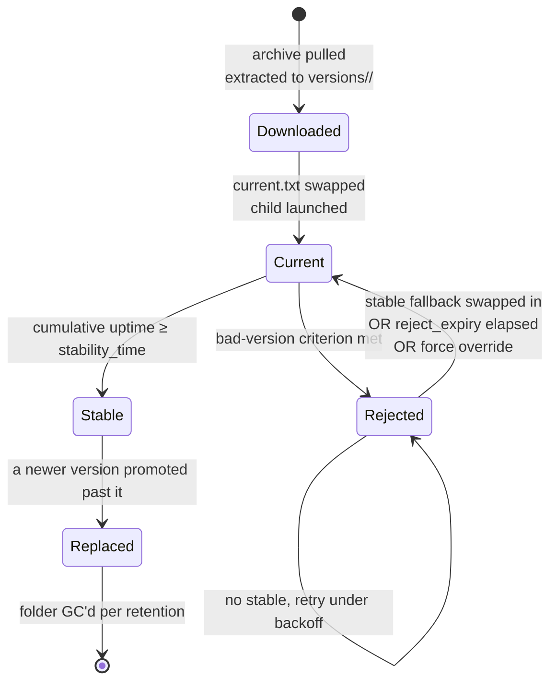

# Go-Run Supervisor

A vendor-controlled supervisor for vendor-controlled components running inside customer-controlled infrastructure, the supervisor counterpart to RunCTL's build mode. One supervisor instance manages N **components**, keeps them running, and pulls signed updates from an HTTPS endpoint the vendor controls. The customer installs once (typically as a Helm chart on their Kubernetes cluster); the vendor pushes versions over the lifetime of the deployment, with no further customer involvement. Linux and macOS first; Windows is out of scope for v0.

Responsibilities:

- Launch components and keep them up (with bounded exponential backoff).
- Pull and apply remote updates with promotion and last-known-good rollback.
- Detect bad versions by short-window crash patterns and blacklist them.
- Aggregate per-component liveness and state via statekit, and expose its own state.
- Accept manual overrides for the rare case the automation needs to be told what to run.

## Why this exists

Plenty of process supervisors already exist (systemd, supervisord, runit, Kubernetes itself). This one is shaped for a specific problem none of them handle cleanly: **shipping vendor-managed software into customer-controlled infrastructure**.

The access model is asymmetric:

- **The vendor** controls the supervisor binary, the update-signing key, the remote endpoint, and the Helm chart at initial install.
- **The customer** controls the Kubernetes cluster (or bare host), the network egress policy, the PVC backing, and whether the supervisor runs at all.
- **The trust boundary**: the customer trusts the supervisor's bundled public key and the integrity guarantees that follow from it. Nothing else; in particular, the vendor never holds cluster credentials.

Consequences that drove the design:

- **No `kubectl apply` per release.** The vendor cannot assume cluster access. New component versions are fetched at runtime and installed in place by the supervisor.
- **Polling-only updates.** The customer is asked to allow one outbound HTTPS destination, not to open an inbound port into their cluster.
- **Helm chart is install-once.** Component changes never require a Helm upgrade. The chart only changes when the supervisor binary itself changes, which should be rare.
- **Cryptographic integrity over network trust.** Every image carries a detached Ed25519 signature verified against the public key shipped inside the supervisor binary. Compromise of the remote endpoint, or any intermediate, cannot push a malicious update.
- **Automatic bad-version rollback.** When the vendor pushes a release that crashes in the customer's environment, the supervisor demotes to stable on its own. The customer is not paged for a vendor-side mistake.
- **Forced overrides for the customer's break-glass.** `forced_versions.txt` lets the customer pin or hold versions if vendor automation is misbehaving, without requiring vendor intervention.

The supervisor is also serviceable as a thin pod-internal supervisor for any in-cluster workload where image-rebuild churn is unwanted. But vendor↔customer separation is the use case that justifies the shape.

## Glossary

| Term           | Meaning                                                                                                                     |
| -------------- | --------------------------------------------------------------------------------------------------------------------------- |
| Component      | A named child process the supervisor supervises. Has its own version triple, version folders, child PID, and monitoring port. |
| Version        | A string identifier (`1.4.2`, `2026-05-22-abc1234`, …). Maps 1:1 to one archive and one extracted folder.                   |
| Image          | A downloaded artefact at `<base>/<component>/images/<version>_<os>_<arch>.tar.gz`. Each logical version is a *family* of one signed archive per supported platform. Decompresses into a version folder. |
| Version folder | `<state_dir>/<component>/versions/<version>/` containing the extracted image. Read-only after extraction.                   |
| Stability      | Cumulative uptime greater than or equal to `stability_time` since first install of a version as current.                    |
| Promotion      | The atomic step that copies the current version identifier into `stable.txt`.                                               |
| Rejection      | The atomic step that appends a version to `rejects.txt` and rolls back.                                                     |

## Deployment Model

The supervisor is a single static binary. It targets two deployment shapes from the same artefact: a bare host running it as a systemd-style service, and a Kubernetes pod where the supervisor is PID 1 and children are co-located subprocesses. Both shapes use the same `state_dir/` layout below.

### State directory

Per-host (or per-pod) state lives under `state_dir/` (default `/var/lib/go-run/`):

```
state_dir/
  supervisor.lock                # flock held while the supervisor is running
  forced_versions.txt
  <component>/
    <component>.yml            # resolved configuration file of the component
    stable.txt
    current.txt
    rejects.txt
    versions/
      <version>/               # one folder per known version
        ...image contents...
```

A second supervisor process trying to start against the same `state_dir/` exits immediately on lock acquisition failure.

### Bare host

systemd unit (or any small higher-level init), under one user account. Children inherit that user. Per-component UIDs are out of scope.

### Bootstrap script (curl-to-shell)

For environments where Kubernetes is overkill and manual systemd setup is friction, the supervisor ships a one-line installer that produces a bare-host setup:

```bash
curl -fsSL https://updates.example.com/install.sh | sh
```

The script is intentionally small and auditable (the customer is encouraged to inspect first via `curl … | tee install.sh | less`). Its job is bootstrap only:

1. Detects `os` and `arch` from `uname`.
2. Downloads the supervisor binary at `<base>/supervisor/<version>_<os>_<arch>` (latest published).
3. Verifies its Ed25519 signature against a public key embedded inline in the script — the same key compiled into the supervisor binary.
4. Hands over to the supervisor in install mode (`./supervisor install`), which does the rest from inside the trusted binary:
   - Create `state_dir/` (default `/var/lib/go-run/`).
   - Write `config.yml` (defaults, optionally seeded from `GO_RUN_CONFIG_URL`).
   - Install a systemd unit on Linux (or a launchd plist on macOS) and enable it.
   - Start the supervisor, which immediately polls for component versions.

Customizable via env vars before piping:

```bash
GO_RUN_REMOTE_BASE_URL=https://updates.example.com \
GO_RUN_STATE_DIR=/var/lib/go-run \
GO_RUN_CONFIG_URL=https://updates.example.com/configs/customer-x.yml \
  curl -fsSL https://updates.example.com/install.sh | sh
```

Idempotent: re-running on an already-installed host short-circuits to a noop. `--upgrade` pulls the latest supervisor binary and restarts the unit; component versions are managed by the supervisor regardless.

Trust separation: the script is the bootstrap anchor (TLS to the vendor's domain + the inline public key). The heavy install logic and ongoing update verification live inside the signed binary, not the shell.

Uninstall: `supervisor uninstall` removes the unit, and with `--purge` also removes `state_dir/`.

### Kubernetes

The supervisor ships as a Helm chart and is deliberately small enough that putting it in a pod is cheap: a `ko-build` artefact lands at single-digit MB on top of `cgr.dev/chainguard/static` (or `gcr.io/distroless/static`). The chart deploys a single-replica `StatefulSet` (so the PVC bind is stable) with PID 1 = the supervisor binary. Components run as subprocesses of PID 1 inside the same pod and share its network namespace.

Why this earns its keep: the remote-update mechanism decouples _component_ releases from _supervisor-image_ releases. New component versions are fetched at runtime from the configured remote; the supervisor container only rebuilds when the supervisor itself changes. You get Kubernetes networking, scheduling, and observability without an image rebuild per component release.

Trade-offs vs. one Deployment per component:

- **Win**: no image build per component change, sub-second component rollback, fewer pod-spec churn events on the cluster.
- **Loss**: pod-level abstractions (`HorizontalPodAutoscaler`, `PodDisruptionBudget`, k8s rolling update) apply to the supervisor pod, not to individual components. If you need k8s-native rollout for a component, run it as its own Deployment instead.

Chart shape (`values.yaml` sketch):

```yaml
image:
  repository: ko.local/go-run-supervisor
  tag: latest
  pullPolicy: IfNotPresent

supervisorConfig: # rendered into a ConfigMap, mounted at /etc/go-run/config.yml
  stability_time: 5m
  crash_window: 10s
  crash_threshold: 3
  exec_fail_threshold: 2
  remote:
    base_url: https://updates.example.com
    target: required.txt
    polling_interval: 1m
    signature_public_key_path: /etc/go-run/update.pub
  components:
    - name: x
      command: "./bin/x"   # cwd=version dir; OP_MONITOR_PORT etc. via env

signaturePublicKey: | # rendered into a ConfigMap (public key, not a Secret)
  -----BEGIN PUBLIC KEY-----
  ...

remoteSecret: # optional, rendered into a Secret if non-empty
  bearer: ""

persistence:
  enabled: true # PVC for state_dir/, default 1Gi
  size: 1Gi
  storageClass: local-path

service:
  enabled: true # exposes supervisor's own-state HTTP on a ClusterIP
  port: 9090

resources:
  requests: { cpu: 50m, memory: 32Mi }
  limits: { memory: 128Mi }

securityContext:
  runAsNonRoot: true
  runAsUser: 65532 # ko-build's default nonroot user
```

Pod-level concerns:

- **`state_dir/` is the PVC mount.** Version folders, the three text files, and the kill sockets all live there. Use a filesystem-backed StorageClass (most local-path provisioners are fine); avoid backends that do not support Unix domain sockets.
- **Supervisor liveness/readiness** is the pod's `livenessProbe` / `readinessProbe` against `/healthz` on the supervisor's own port. Component health is internal: monitoring tools scrape the supervisor's own-state, or scrape components by port-forwarding through the supervisor's network namespace.
- **Logs**: supervisor and children both write to stdout/stderr so `kubectl logs` captures everything. The supervisor prefixes child log lines with the component name.
- **Updates to the supervisor binary itself** happen via Helm release (new image tag). Updates to component images are remote-fetched and never trigger a pod restart.
- **`forced_versions.txt`** lives on the PVC and can be edited via `kubectl exec` for break-glass overrides.

## Communicating with the Services

### Monitoring port

Each component declares a port in its config; the supervisor exports it as `OP_MONITOR_PORT` in the child's environment. The child is expected to serve at least:

- `GET /healthz`: 200 OK if the process considers itself alive.
- `GET /readyz`: 200 OK if ready to accept work.
- `GET /state`: JSON with the child's self-reported state (consumed by statekit).
- `GET /metrics`: Prometheus exposition (optional but conventional).

The supervisor polls `/healthz` at a fixed interval. Consecutive failures are tracked alongside crash counters.

### Kill switch

For each component the supervisor opens sa Unix domain socket at `state_dir/<component>/kill.sock`, mode `0600`, owned by the supervisor's UID. The child is told the path via `${KILL_SOCK}` and `OP_KILL_SOCK`. Connecting and writing `KILL\n` is the supported shutdown signal.

Filesystem permissions enforce "only the launcher can kill": nothing else on the machine running as a different UID can open the socket. No shared secret, no token rotation.

The supervisor falls back to `SIGTERM` followed by `SIGKILL` after `kill_grace_period` on the process group (`Setpgid` is set on every child) if the socket does not accept a connection within a few seconds.

## Secrets, Variables and Code

Todo. Open question: are secrets per-component env files maintained outside `version_dir`, or pulled by the child from its own configured store (Vault, file, cloud secret manager) using identity derived from the supervisor? Either way, secret material must not live inside `version_dir` (because images are content-addressed and replaceable) and must not be logged via `${...}` template expansion.

## Version Management

### Local versions

Each component holds three small text files. `stable.txt` and `current.txt` each hold one version string, newline-terminated. `rejects.txt` is a list, one version per line.

- `stable.txt`: the current stable version.
- `current.txt`: the version the supervisor is currently running.
- `rejects.txt`: versions that were rejected, and should not be re-downloaded.

Each version is a folder for that component with the version name. The folder is created once the archive has been fully extracted. Vendor-shipped contents (the binary, any `*.tmpl` files, an optional `defaults.yml`) are never modified after extraction. The supervisor is allowed to write **rendered template outputs** (see §"Template rendering") and their `.bak` backups into the same folder; nothing else gets written there. The three text files (`stable.txt`, `current.txt`, `rejects.txt`) name versions; the version folder is where the bits live. The three files are the source of truth; `state.json` is a derived journal that can be rebuilt by scanning them.

All three files are updated by `WriteFile → fsync → Rename` to make the swap atomic. The supervisor is the only writer.

When the current version has accumulated `stability_time` of uptime since its first install, the supervisor atomically copies its identifier into `stable.txt`. The version folder is not moved or renamed; `stable.txt` and `current.txt` may point at the same version.

### State machine



### Remote update

Supervisor polls `<base_url>/<component>/versions/<remote_target>` at `polling_interval` (default 1m). The response body is either a version string, or a redirect: if the body starts with `@`, e.g. `@required2.txt`, the supervisor fetches `<base_url>/<component>/versions/required2.txt` and repeats. Maximum chain length is 5; visited URLs are tracked to detect loops. A loop or overflow is a polling failure and does not reject any version.

The version references a *family* of platform-specific images. The supervisor picks the artefact matching its own `runtime.GOOS` and `runtime.GOARCH` at install time:

```
<base>/<component>/images/<version>_<os>_<arch>.tar.gz       # archive
<base>/<component>/images/<version>_<os>_<arch>.tar.gz.sig   # detached Ed25519 signature
```

For example, a vendor releasing version `1.4.2` typically publishes some subset of `1.4.2_linux_amd64.tar.gz`, `1.4.2_linux_arm64.tar.gz`, `1.4.2_darwin_arm64.tar.gz`, each with its own `.sig`. The version string stored in `stable.txt` / `current.txt` / `rejects.txt` is the family identifier (`1.4.2`); the platform suffix is constructed only when building the download URL, and the version folder on disk is named `1.4.2` without a platform suffix (one supervisor runs one platform).

If the resolved version is:

- equal to `current.txt`: nothing to do.
- present in `rejects.txt`: logged prominently, not re-downloaded. Own-state surfaces "required version is rejected, holding stable Y" (or "no stable, halted").
- missing for this platform (404 on the archive or the signature): logged prominently, treated as a *polling failure*, **not** added to `rejects.txt`. The version is not the fault here; the vendor has not published for this platform. Recovery is for the vendor to publish, or for the customer to force a different version.
- otherwise: proceed to install.

Rejections in `rejects.txt` are scoped to the host that observed the bad behaviour. A version that crashes on `linux_arm64` is not automatically blacklisted for `darwin_amd64` hosts — each supervisor instance keeps its own `rejects.txt`.

#### Install sequence

1. Download `<base_url>/<component>/images/<version>_<os>_<arch>.tar.gz` into a staging file, where `<os>` and `<arch>` come from the supervisor's `runtime.GOOS` and `runtime.GOARCH`.
2. Verify the detached signature (`<version>_<os>_<arch>.tar.gz.sig`, Ed25519, public key shipped with the supervisor). Failed signature is a polling failure with no state change.
3. Extract into `state_dir/<component>/versions/<version>/`. Reject any archive entry with an absolute path or a `..` component.
4. Atomically swap `current.txt` to the new version. **This is the commit point.**
5. Terminate the existing child via the kill switch (with the SIGTERM/SIGKILL fallback) and launch the new one against the new folder.

A crash before step 4 leaves `current.txt` unchanged and the partially extracted folder is orphan garbage. A crash at step 4 is atomic by `rename`. A crash after step 4 means the next supervisor start sees the new `current.txt`, the complete folder, and resumes by launching the child. There is no half-committed state.

#### Orphan folder cleanup

On startup the supervisor lists `versions/*` and identifies any folder whose name is not in `stable.txt`, `current.txt`, or `rejects.txt`. The newest `version_folder_retention` orphans (default 2) are kept in case a manual rollback is wanted. The rest are deleted.

#### Launch environment

The `command:` field is parsed verbatim as a shell-style argv (via shlex). There is **no** `${VAR}` substitution in the command — values that vary per launch flow through environment variables instead.

Before exec the supervisor:

- Sets the child's working directory to the version dir. A relative `command: "./bin/hello"` therefore resolves to the binary inside the tarball. Absolute paths still work; bare names (no slash) fall through to `PATH` lookup, matching shell semantics. The child is *not* chrooted — global paths like `/var/log` remain reachable.
- Exports the five launch facts as `OP_`-prefixed environment variables:

  | Env | Meaning |
  | --- | --- |
  | `OP_VERSION` | current version string |
  | `OP_VERSION_DIR` | absolute path of the version folder (also the cwd) |
  | `OP_STATE_DIR` | absolute path of the component's state directory |
  | `OP_MONITOR_PORT` | configured monitoring port |
  | `OP_KILL_SOCK` | absolute path of the kill-switch UDS |

A child that wants the port from env reads `OP_MONITOR_PORT`; a child that wants it on argv hardcodes the same number (the customer already chose it in `port:`) or pulls it from a top-level `vars:` block via Go template at config-load.

The same five values are also available as top-level keys (`.VERSION`, `.VERSION_DIR`, …) inside `*.tmpl` files at render time — see §"Template rendering".

#### Template rendering (deployment-time config)

The shell-style command template above is for argv only. The vendor can also ship arbitrary configuration files as templates inside the tarball, and the supervisor renders them at launch time.

Any file in the extracted version dir whose name ends in `.tmpl` is treated as a template. At every launch the supervisor:

1. Builds a template context by merging four layers (precedence high → low):
   - **env vars** (only via `{{ env "FOO" }}` references inside templates);
   - **supervisor.yml `vars:` block** — customer-controlled, flat global map;
   - **`defaults.yml`** at the root of the version dir — vendor-shipped baseline;
   - **launch variables** as top-level keys (`VERSION`, `VERSION_DIR`, `STATE_DIR`, `MONITOR_PORT`, `KILL_SOCK`).
2. Walks the version dir alphabetically. For each `<x>.tmpl`:
   - Renders the body using Go `text/template` with the same engine the rest of go-run uses (delimiters `{{ }}` and `[[ ]]`, funcs `default` / `required` / `env` / `add`).
   - If `<x>` already exists from a previous render, it is renamed to `<x>.bak` (single-level backup, replacing any prior `.bak`).
   - Writes `<x>` via `atomicWrite` with the same file mode as the source `.tmpl` (preserves executability).
3. First render error short-circuits the launch and counts as an `exec_failure`.

Cadence is **passive**: templates are re-rendered every launch, so a `vars:` edit picks up on the next child restart. There is no fsnotify watch in v0.

`defaults.yml` is optional. A tarball with no `defaults.yml` renders against only `vars:` + launch vars + env.

Example layout for a hello component:

```
versions/v1/
  defaults.yml             # vendor-shipped: { GREETING: "Hello (vendor default)" }
  greeting.txt.tmpl        # vendor-shipped: {{ .GREETING }}
  greeting.txt             # supervisor-rendered
  greeting.txt.bak         # previous render
  bin/hello                # vendor-shipped binary, reads ./greeting.txt (cwd=this dir)
```

The child finds its rendered files in its working directory (which equals `OP_VERSION_DIR`).

## Handling crashes

Components that crash get restarted. Consecutive crashes that match the **bad-version criterion** revert the component to stable. When there is no stable to revert to, or when the stable is itself the one crashing, the supervisor falls back to exponential backoff restarts and does not auto-reject the version.

### Bad-version criterion

The current version is added to `rejects.txt` when **either** counter trips:

| Counter         | Trigger                                                                                              | Default threshold |
| --------------- | ---------------------------------------------------------------------------------------------------- | ----------------- |
| `fast_crashes`  | child exited (any non-zero exit or fatal signal) within `crash_window` of being launched             | 3                 |
| `exec_failures` | the supervisor could not start the child (ENOENT, EACCES, malformed binary, missing template variable) | 2                 |

A **fast crash** is an exit within `crash_window` (default 10s) of launch. Exits _after_ `crash_window` are normal restarts under backoff and are not bad-version evidence.

Counter scope:

- Both counters are **per current-version-install**. Demoting a version to stable and later re-installing it as current starts fresh.
- Both counters are **wiped at promotion to stable**. A stable version that later crashes triggers restart-with-backoff but is never auto-rejected. Losing the only known-good thing because of an environment hiccup is worse than a restart loop.

### Outcome of rejection

1. Append the version to `rejects.txt` with the rejection timestamp.
2. If `stable.txt` names a different version, atomically swap `current.txt` to it and relaunch. Counters reset, backoff resets.
3. If no different stable exists, **the supervisor keeps relaunching the rejected version under backoff** (no halt). Counters are reset so the next exit doesn't immediately re-demote, but the backoff stays growing so spacing between attempts widens up to its cap. The state appears as `running_rejected` (statekit `fail`) when the child is up, or `restarting` (warn) between attempts; the reason text names the specific reason there was no fallback ("no stable known yet" / "stable.txt names the same version").

The principle: an autonomous rejection deserves an autonomous retry path. The supervisor never paints itself into a corner where it stops trying — operator intervention is *available* (force overrides) but not *required*.

### Reject expiry

Every entry in `rejects.txt` carries the timestamp of the rejection. The `reject_expiry` config knob (no default — opt-in) caps how long an entry stays active. After `reject_expiry` elapses, the supervisor stops treating the version as rejected and is willing to re-install it if the remote still asks for it. If the version is genuinely still bad it'll be re-rejected on the next bad-version cycle, with a fresh timestamp.

This pairs with the no-stable retry: a transient environmental issue that caused the original rejection self-clears once the patch window has passed, with no operator action.

### Restart backoff

Exponential with jitter, `min(base * 2^n, cap) + rand(0, base)`. Defaults: `base` 1s, `cap` 60s. The backoff resets to zero once the child runs continuously for at least `stability_time` (the same stability event that wipes the crash counters). It also resets on a demote that successfully swaps to a different stable. It does **not** reset on a no-stable demote — that's the case where keeping the spacing growing is exactly what we want.

## Own State

The supervisor exposes its own HTTP server (`supervisor.bind_address`, default `127.0.0.1:9090`):

- `GET /healthz`: supervisor is alive.
- `GET /state`: statekit YAML document. Aggregates the supervisor's local per-component view (`<name>.supervisorstate`) with scraped child entries (`<name>` mirrored from the child, `<name>.up` from the liveness probe). All entries carry `scraped_from: <component>` so a fleet aggregator can group them.
- `GET /metrics`: Prometheus exposition (supervisor counters + scraped child metrics).
- `GET /summary`: flat, grep-friendly YAML overview of each managed component.
- `GET /components/{name}/info`: supervisor-side bookkeeping for one component (version triple, pid, counters, port, monitor URL paths).
- `GET /components/{name}/state`: statekit document filtered to entries tagged `scraped_from: <name>`.
- `POST /components/{name}/reject?version=X`: append `X` to that component's `rejects.txt` (used by a control plane to force a demote).

**Status vocabulary is statekit's**: `pass` / `warn` / `fail` / `down`. There is no parallel "supervisor enum". The granular situation ("running rejected", "pinned to stable after rejecting v3", "preparing v2", "child exited, restarting in N") lives in the reason text on each statekit leaf.

The supervisor's `<name>.supervisorstate` is an AggregateState with two leaves:

- `uptime` (important): the lifecycle — `pass` when the child is running cleanly, `warn` when pinned to stable as a fallback or restarting/installing, `fail` when running a still-rejected version. Carries the per-state metrics (`runcount`, `uptime_seconds`, `fast_crashes`, `exec_failures`).
- `update` (informational): the update flow — `pass` after a successful remote poll, `fail` on poll/prepare error (capped at warn in the aggregate because failures here mean "we couldn't reach the vendor", not "the workload is broken").

`state.json` (statekit-owned, optional) would be a journal of transitions on disk; presently statekit's history is in-memory only and reset on supervisor restart.

## Force version, Force stable

The supervisor can be told, via a `forced_versions.txt` file under `state_dir/`, to lock specific components to a specific version, or to stable, or all components to stable. One line per component:

```
component-a = 1.4.2
component-b = stable
* = stable
```

Semantics:

- `<component> = <version>`: lock that component to that exact version. Download from remote if not present locally. Allowed to override `rejects.txt`; the supervisor logs the override loudly but obeys.
- `<component> = stable`: lock to whatever is currently in `stable.txt`; do not promote new versions.
- `* = stable`: apply the stable lock to every component.

Precedence: `forced_versions.txt` > `rejects.txt` > remote required. The supervisor re-reads the file on every polling tick.

If `* = stable` is in force and a component has no `stable.txt`, that component reports `forced_no_stable` and is halted until a stable exists or the override is changed.

## Configuration

YAML, loaded at startup.

```yaml
state_dir: /var/lib/go-run

stability_time: 5m
crash_window: 1m
crash_threshold: 3
exec_fail_threshold: 2
kill_grace_period: 5s
version_folder_retention: 2
reject_expiry: 0           # 0 = rejections never auto-clear; e.g. 24h to opt in

# Customer-controlled template context for every component's *.tmpl files.
# Overrides keys from each version's defaults.yml. See §"Template rendering".
vars:
  GREETING: "Hello, customer"
  UPSTREAM_URL: "https://upstream.internal"

supervisor:
  bind_address: 127.0.0.1:9090

remote: # defaults shared across components
  base_url: https://updates.example.com
  target: required.txt
  polling_interval: 1m
  secret: "" # optional bearer for the remote
  signature_public_key_path: /etc/go-run/update.pub

components:
  - name: x
    command: "./bin/x"   # cwd=version dir; OP_MONITOR_PORT etc. via env
    env:
      LOG_LEVEL: info
    remote: {} # optional per-component override of the block above
```

## Implementation Notes

- **Process groups**: `Setpgid: true` on every child. Signal the whole group on shutdown so grandchildren do not leak.
- **Atomic file writes**: one helper `atomicWrite(path, data)` doing `WriteFile(tmp) → fsync → Rename`. Use it for every state file.
- **Single-instance guard**: `flock` on `state_dir/supervisor.lock`. The kernel releases the lock when the holding process dies, so a crashed supervisor does not leave a stale lock.
- **HTTP timeouts**: explicit `Dial`, `TLSHandshake`, response-header, and total deadlines on every outbound request. Use conditional GET (`If-Modified-Since` / `ETag`) on `required.txt` so polling stays cheap.
- **Archive format**: tar.gz only. Validate paths against tar-slip before writing any file (no absolute paths, no `..` components).
- **statekit role**: own-state aggregation and the transition journal. It does _not_ hold the version triple. Those are the three text files.

## Out of Scope (v0)

- **Supervisor self-update**: the supervisor binary is shipped and replaced externally. A tiny re-exec bootstrap can be added later.
- **Per-component UIDs**: all children run as the supervisor's user.
- **Push-based updates**: polling only. Long-poll or websocket can be added if latency demands.
- **Windows support**: the kill-switch UDS and `Setpgid` are POSIX. A Windows port would need a parallel mechanism.

## Open Questions

- **Secrets management**: see Todo in §"Secrets, Variables and Code".
- **Health-check failures as rejection input**: today only process exits feed `fast_crashes`. The supervisor's scraper does liveness-probe `/healthz` and surfaces failures as the `<name>.up` state, but `/healthz` failures do not contribute to the bad-version criterion. Should consecutive failures within `crash_window` also count? Lean: yes, with a higher threshold (e.g. 6 consecutive failures over 30s) because health checks can flap for reasons unrelated to the version.

### Resolved

- **Promotion clock**: implemented as cumulative uptime. The child has to be alive continuously for `stability_time` for promotion to fire; a restart resets the accumulation. Cumulative-across-restarts was rejected as a deferred refinement.
- **No-stable rejection**: original spec halted; the implementation keeps retrying with bounded backoff. See §"Outcome of rejection".
- **Reject permanence**: original spec was indefinite; the implementation supports `reject_expiry` for autonomous clearing (off by default). See §"Reject expiry".
